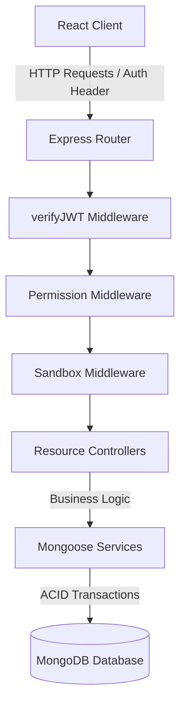

# 📐 System Architecture & Models

This document describes the technical architecture, database models, custom middlewares, and structural components of the **Evolve Lab Inventory Management System**.

---

## 🏛️ System Overview

Evolve Lab utilizes a clean layered architecture separating concerns across the frontend and backend:



- **Client Layer**: A responsive Single Page Application (SPA) utilizing React 19, Vite, and Tailwind CSS.
- **Routing & Middleware Layer**: Express routers equipped with JWT validation, permission whitelists, and database write sandboxes.
- **Controller & Service Layer**: Controllers process client request contracts while Mongoose services implement isolation and database transactions.
- **Database Layer**: MongoDB stores core application assets with schema compliance enforced by Mongoose.

---

## 🗄️ Database Models & Schema Specifications

The system is modeled around five Mongoose schemas located in `server/src/models/`:

### 1. User Model (`user.model.js`)
Stores authenticated lab users, roles, and flags.
```javascript
{
  name: { type: String, required: true },
  email: { type: String, required: true, unique: true, index: true },
  password: { type: String, required: true },
  role: { type: String, enum: ["manager", "user"], default: "user" },
  isDemo: { type: Boolean, default: false } // Flag identifying sandboxed guest accounts
}
```

### 2. Component Model (`component.model.js`)
Tracks hardware components, their statuses, and quantities.
```javascript
{
  name: { type: String, required: true, index: true },
  image: { type: String, required: true },
  description: { type: String, default: "" },
  component_working: { type: Number, default: 0 },
  component_not_working: { type: Number, default: 0 },
  component_in_use: { type: Number, default: 0 },
  total_quantity: { type: Number }, // Auto-computed on save (working + not_working + in_use)
  remark: { type: String, default: "" },
  category: { type: String, required: true, index: true },
  isDemo: { type: Boolean, default: false },
  createdBy: { type: String, default: "system" }
}
```

### 3. Request Model (`request.model.js`)
Manages component borrow lifecycles, states, and transactions.
```javascript
{
  userId: { type: Schema.Types.ObjectId, ref: "Users", required: true, index: true },
  componentId: { type: Schema.Types.ObjectId, ref: "Components", required: true, index: true },
  quantity: { type: Number, required: true },
  status: { 
    type: String, 
    enum: ["pending", "approved", "rejected", "submitted", "returned"], 
    default: "pending" 
  },
  isDemo: { type: Boolean, default: false }
}
```

### 4. Log Model (`log.model.js`)
Audits mutations performed across the lab's inventory.
```javascript
{
  userId: { type: Schema.Types.ObjectId, ref: "Users", required: true },
  userName: { type: String, required: true },
  action: { type: String, required: true }, // e.g. "CREATE", "UPDATE", "BORROW"
  details: { type: String, required: true },
  isDemo: { type: Boolean, default: false }
}
```

### 5. Wishlist Model (`wishlist.model.js`)
Stores a pre-registration email whitelist. Users can only register if their email exists in this collection.
```javascript
{
  username: { type: String, required: true },
  email: { type: String, required: true, unique: true }
}
```

---

## 🛡️ Custom Middleware Layer

Middlewares located in `server/src/middlewares/` intercept and secure resource mutations:

### 1. JWT Verification (`auth.middleware.js`)
Verifies incoming Bearer tokens sent in the `Authorization` header, extracts user claims, and appends the user object to the Express request object (`req.user`).

### 2. Role-Based Permissions (`permission.middleware.js`)
Dynamically enforces route-level access maps defined in `config/permissions.js`:
- Prevents standard users from requesting admin endpoints (e.g. updating inventories, modifying user directories).
- Limits demo accounts to read-only capabilities on production records while allowing them to write to demo-tagged objects.

### 3. Database Sandbox Isolation (`sandbox.middleware.js`)
Protects database integrity from public mutations by guest demo accounts. Check the [Demo Mode Guide](./demo-mode.md) for a deep dive.

---

## ⚡ ACID Transactions & Component Workflows

To prevent race conditions, double-allocations, or quantity inconsistencies, borrowing/returning a component executes within a **Mongoose session transaction**:

1. **Borrow Component**:
   - Begins a session transaction.
   - Verifies component working stock: `component.component_working >= request.quantity`.
   - Decreases `component_working` and increases `component_in_use`.
   - Saves component changes and updates request status to `approved`.
   - Commits transaction.

2. **Return Component**:
   - Begins session transaction.
   - Restores item allocations: decreases `component_in_use` and increases `component_working` (or `component_not_working` if marked broken).
   - Saves component changes and sets request status to `returned`.
   - Commits transaction.

If any database error, validation failure, or out-of-stock scenario occurs, the transaction is **aborted**, rolling back all modifications instantly.
